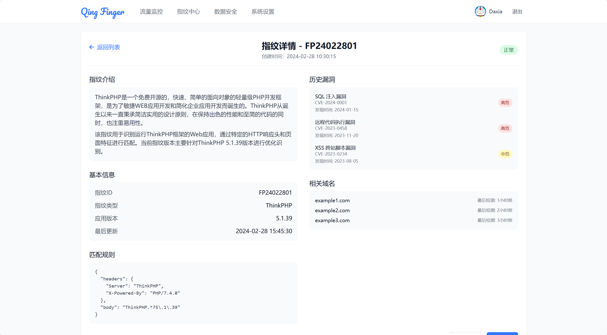

## **📘 平台概述**
Qing Finger 流量分析平台是一款集**流量监控、指纹识别、数据安全检测**于一体的多功能流量分析系统。用户可通过设置代理地址，将流量数据实时存储到数据库，系统提供的多维数据分析功能可高效识别敏感信息和指纹特征，帮助企业实现**数据可视化、风险预警和隐私保护**。
 

## **⚙️ 系统原理**
1. **代理服务**
    - 用户设置**代理地址**，流经的流量数据会被自动存储到数据库中。

2. **指纹识别模块**
    - **指纹识别脚本**会读取存储的流量数据，并将数据发送至**GPT模型**进行**用户指纹识别**，输出用户的特征数据，便于识别设备、行为和偏好。

3. **数据安全检测模块**
    - **数据安全脚本**从数据库中读取流量数据，利用**正则表达式**识别其中的敏感信息 
    - 系统会对检测到的敏感信息进行标记，以便后续操作和风险预警。
 

## **🖥️ 系统页面**
平台提供了多种可视化操作界面，用户可快速查询和监控流量数据、指纹信息及数据安全状态。

### **1️⃣ 流量监控列表页**
- **功能描述**  
  通过表格列表的形式展示**所有流量请求的基本信息** 

- **主要操作**
    - 通过筛选条件（IP、时间范围、URL等）快速定位目标流量。
    - 可点击流量记录，跳转到**流量监控详情页**。
  

### **2️⃣ 流量监控详情页**
- **功能描述**  
  详细展示**单条流量请求的完整数据包**和**数据解析结果** 

- **主要操作**
    - 查看和标记数据中的**敏感信息**。
    - 将该请求中的数据发送至**指纹中心**进行指纹分析。

### **3️⃣ 指纹中心列表页**
- **功能描述**  
  通过表格形式展示系统识别到的**用户指纹信息**，如设备标识、操作行为和偏好数据 

- **主要操作**
    - 支持按“设备类型”、“活跃时间”等筛选和排序指纹信息。
    - 可点击指纹ID，跳转至**指纹中心详情页**，查看该指纹的历史操作记录。

### **4️⃣ 指纹中心详情页**
- **功能描述**  
  展示某一**特定用户指纹的详细行为信息**，帮助企业分析用户的操作习惯、设备环境和偏好 

- **主要操作**
    - 分析指纹的活跃时间、行为模式、是否为“可疑设备”。
    - 可对指纹信息进行标记和分类（如标记为“可疑设备”或“可信设备”）。

### **5️⃣ 数据安全列表页**
- **功能描述**  
  以**数据敏感性检测结果为核心**的界面，展示**所有含敏感数据的请求**，便于用户进行隐私保护和数据合规分析 

- **主要操作**
    - 支持通过敏感信息类型、时间等条件筛选**高风险数据**。
    - 点击某一请求可跳转到**流量监控详情页**，查看敏感数据的上下文信息。

## **📌 核心功能亮点**

- **实时流量监控**：实时监控网络流量，直观展示**请求详情**，支持筛选、排序和风险预警。
- **指纹追踪识别**：基于GPT的指纹分析，自动识别**用户的设备特征和操作行为**，帮助企业识别“可疑访问者”。
- **敏感信息检测**：利用**正则匹配算法**，高效检测流量中的**身份证、手机号、邮箱等敏感数据**，帮助企业进行数据合规性管理。
- **多维数据可视化**：多种视图和筛选方式，快速定位**可疑流量、风险数据和异常指纹**，极大提高了数据分析的效率。
- **安全性和隐私保护**：内置敏感信息的标记和加密处理，确保数据在展示和存储过程中的**隐私合规性**。

## **📞 联系我们**
如需帮助或有其他问题，请联系**技术支持团队**。  
邮箱：78778443@qq.com